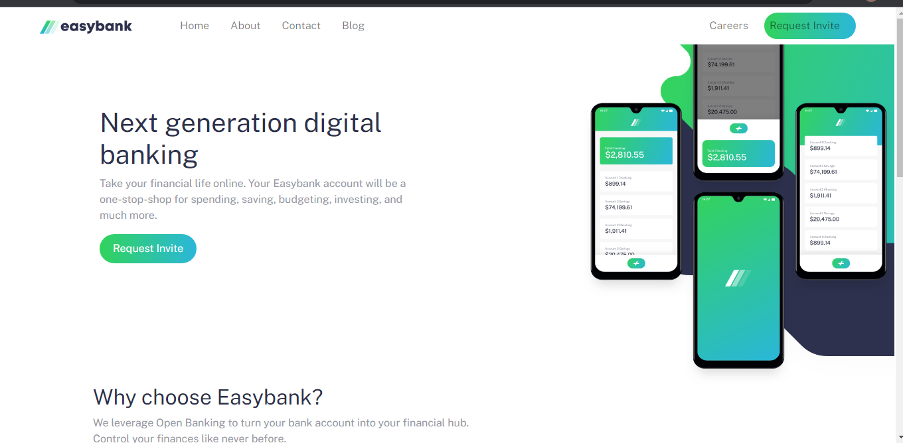
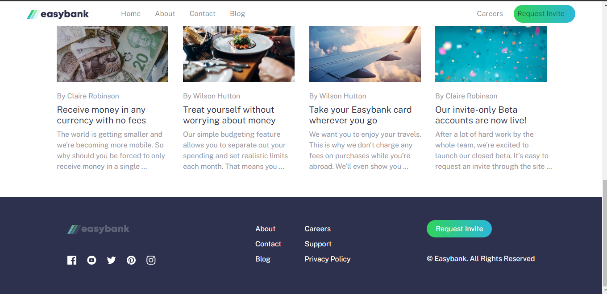
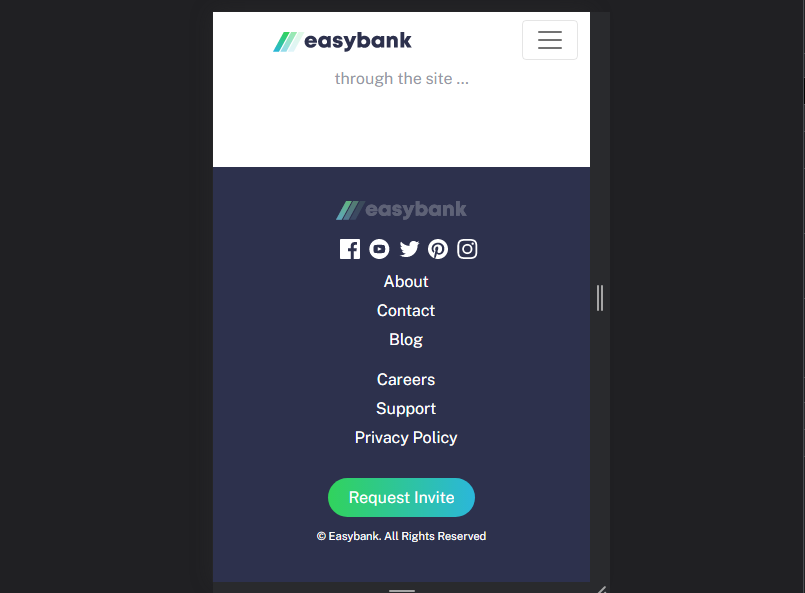

# Frontend Mentor - Easybank landing page solution

This is a solution to the [Easybank landing page challenge on Frontend Mentor](https://www.frontendmentor.io/challenges/easybank-landing-page-WaUhkoDN). Frontend Mentor challenges help you improve your coding skills by building realistic projects. 

## Table of contents

- [Overview](#overview)
  - [The challenge](#the-challenge)
  - [Screenshot](#screenshot)
  - [Links](#links)
  - [Built with](#built-with)
- [Author](#author)

## Overview

FEM Easy-banking landing page

### The challenge

Users should be able to:

- View the optimal layout for the site depending on their device's screen size
- See hover states for all interactive elements on the page

### Screenshot

.png)
.png)

.png)
.png)
.png)
.png)

### Links

- Solution URL: [Git repo url](https://github.com/Plut0r/Landing-page)
- Live Site URL: [Git live url](https://plut0r.github.io/Landing-page/)

### Built with

- Semantic HTML5 markup
- CSS custom properties
- Flexbox

## Author

- Frontend Mentor - [@Plut0r](https://www.frontendmentor.io/profile/Plut0r)
- Linkedin - [@plut0r](www.linkedin.com/in/plut0r)
